<table width="100%">
  <tr>
    <td width="50%" align="center">
      
    </td>
    <td width="50%" align="center">
      
    </td>
  </tr>
</table>

---

# Olá, eu sou o Paulo Correia 👋

**Software Engineer em formação | Backend Java | Arquitetura e Boas Práticas**

Sou um profissional de tecnologia em evolução para Engenharia de Software, com atuação prática em ambientes corporativos, integrações, automações e desenvolvimento de soluções internas.

Meu foco hoje está em desenvolvimento **back-end com Java e ecossistema Spring**, construção de APIs, persistência de dados, consumo de serviços externos e organização de aplicações em camadas.

Mais do que apenas escrever código, tenho buscado entender **decisões de projeto**: orientação a objetos, princípios SOLID, separação de responsabilidades, Design Patterns e fundamentos que ajudam a construir software mais legível, flexível e sustentável.

---

## 🚀 Atualmente estudando

- Java e Spring Boot
- APIs REST e integração entre sistemas
- JPA, Hibernate, SQL e modelagem relacional
- Clean Code, SOLID e Design Patterns
- UML, modelagem de domínio e análise orientada a objetos
- Desenvolvimento assistido por IA e Spec-Driven Development

---

## 🧭 Minha linha de estudo

Gosto de estudar tecnologia conectando teoria com prática.

Em vez de apenas decorar conceitos, tento seguir uma linha simples:

```txt
problema -> percepção -> solução -> aplicabilidade
```

Essa abordagem aparece nos meus repositórios de estudo, onde organizo anotações, exemplos e decisões técnicas para acompanhar minha evolução.

---

## 🛠️ Tecnologias e ferramentas

### Backend


### Banco de dados


### Frontend e integrações


### Engenharia de software


---

## 💼 Experiência

**Analista de TI - WH1 Cloud**  
Desde agosto de 2024

- Implantação e administração de ambientes Google Workspace para clientes corporativos
- Análise e resolução de incidentes em suporte técnico avançado
- Suporte a integrações com aplicações externas
- Apoio em projetos de automação
- Desenvolvimento técnico de agentes de IA para uso organizacional

---

## 📌 Projeto em destaque

### Sistema de integração e gestão de dados

Projeto com foco em backend usando **Java + Spring**, APIs REST, persistência com **JPA/Hibernate**, banco relacional **MySQL**, versionamento de banco com **Flyway** e integração com APIs externas.

Também inclui frontend em **Vue.js** consumindo APIs próprias.

---

## 📚 Repositórios de estudo

### [software-design-studies](https://github.com/p-rcorreia/software-design-studies)

Repositório dedicado aos meus estudos sobre design de software, arquitetura, modelagem, princípios de design e boas práticas de desenvolvimento backend.

Organização atual:

- Clean Code
- SOLID
- UML e Larman
- Design Patterns

---

## 🎓 Formação e certificações

**Bacharelado em Ciência da Computação**  
Cruzeiro do Sul Virtual | 2022 - 2026

Certificações:

- AWS Certified Cloud Practitioner
- Professional Google Workspace Administrator
- Google Cloud Digital Leader
- Generative AI Leader Certification

---

## 🌱 Como eu enxergo minha evolução

Estou em um momento de crescimento técnico, construindo uma base sólida em desenvolvimento backend e engenharia de software.

Tenho buscado evoluir com constância, entendendo não apenas como usar tecnologias, mas por que determinadas decisões tornam um sistema mais simples de manter, testar e evoluir.

---

## 📫 Contato

- 📍 Piumhi - MG, Brasil
- ✉️ **paulojavase@gmail.com**
- GitHub: [@p-rcorreia](https://github.com/p-rcorreia)
