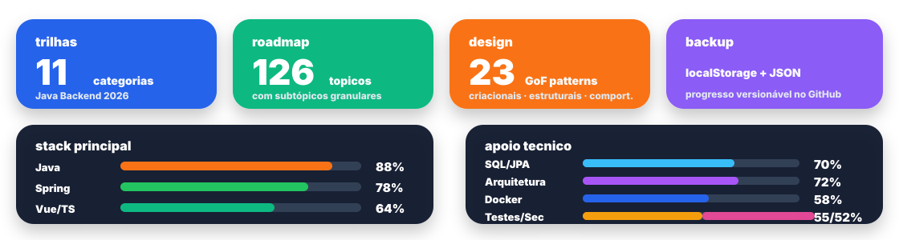
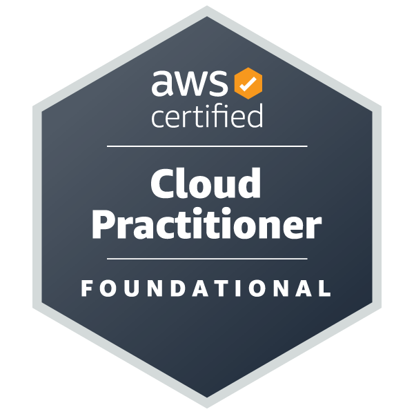
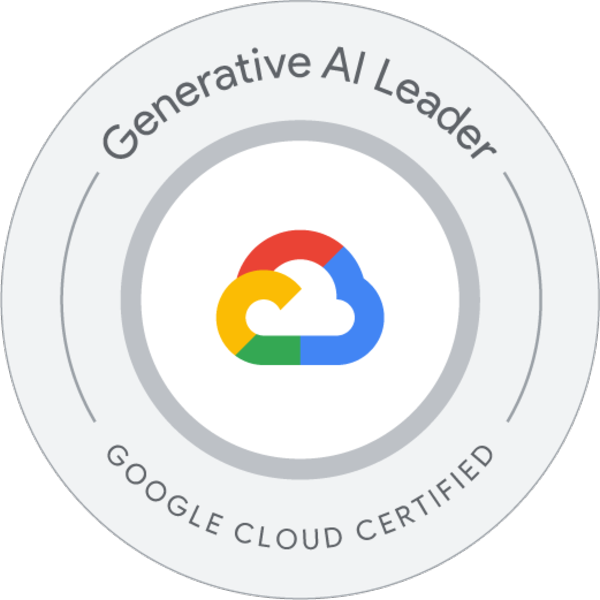

<p align="center">
  
</p>

---

# Olá, eu sou o Paulo Correia 👋

**Software Engineer em formação | Java Backend | Spring Boot | Arquitetura e Boas Práticas**

Sou um profissional de tecnologia em evolução para Engenharia de Software, com atuação prática em ambientes corporativos, integrações, automações e desenvolvimento de soluções internas.

Meu foco atual está em desenvolvimento **backend com Java e ecossistema Spring**, construção de APIs, persistência de dados, segurança, testes, Docker, arquitetura e evolução de aplicações com código limpo.

Mais do que apenas escrever código, tenho buscado entender **decisões de projeto**: orientação a objetos, SOLID, Design Patterns, UML, Clean Code, TDD, Specification Driven Design, separação de responsabilidades e fundamentos que ajudam a construir software mais legível, testável e sustentável.

---

## 🚀 Atualmente estudando

- Java moderno: Java 17+, Java 21/25 LTS, JVM, compilação, execução, concorrência e virtual threads
- Spring Boot, Spring Web MVC, Spring Data JPA, Hibernate, Bean Validation e Actuator
- APIs REST/RESTful, status HTTP, ResponseEntity, tratamento global de erros e Problem Details
- Padrões de comunicação: REST, SOAP, RPC, gRPC, GraphQL, Webhooks e mensageria
- Banco de dados, SQL, modelagem relacional, transações, índices, migrations, PostgreSQL e Redis
- Segurança de APIs: OAuth2, OpenID Connect, Bearer Token, JWT, PKCE, Keycloak, RBAC/ABAC e OWASP API Top 10
- Testes com JUnit 5, Mockito, Spring Boot Test, Testcontainers, testes de contrato, testes de arquitetura e TDD
- Arquitetura em camadas, Clean Architecture, arquitetura hexagonal, DDD, monólito modular e microserviços
- SOLID, Clean Code, UML, Design Patterns GoF e extensibilidade sem switch gigante
- Docker, CI/CD, observabilidade, cloud, Kubernetes e produção
- Desenvolvimento assistido por IA e Specification Driven Design

---

## 🧭 Minha linha de estudo

Gosto de estudar tecnologia conectando teoria com prática.

Em vez de apenas decorar conceitos, tento seguir uma linha simples:

```txt
problema -> percepção -> solução -> aplicabilidade
```

Essa abordagem aparece nos meus repositórios de estudo, onde organizo anotações, exemplos, decisões técnicas e pequenos projetos para acompanhar minha evolução.

---

## 🛠️ Tecnologias e ferramentas

### Backend


### Banco de dados


### Frontend, documentação e integração


### DevOps e produção


### Engenharia de software


---

## 💼 Experiência

**Analista de TI - WH1 Cloud**  
Desde agosto de 2024

- Implantação e administração de ambientes Google Workspace para clientes corporativos
- Análise e resolução de incidentes em suporte técnico avançado
- Suporte a integrações com aplicações externas
- Apoio em projetos de automação
- Desenvolvimento técnico de agentes de IA para uso organizacional

---

## 📌 Projeto em destaque

### [Java Backend Developer Roadmap 2026](https://github.com/p-rcorreia/java-backend-developer-roadmap-2026)

Aplicação frontend em **Vue 3 + Vite + TypeScript + Tailwind CSS** para acompanhar minha evolução nos estudos de backend Java.

O projeto transforma um roadmap de estudos em um painel interativo com:

- 11 trilhas de estudo
- mais de 120 tópicos de evolução
- os 23 Design Patterns GoF organizados por categoria
- progresso geral e por categoria
- checklist de subtópicos
- favoritos, filtros e busca
- anotações pessoais por tópico
- modo claro/escuro
- persistência em `localStorage`
- backup versionável em `data/progress.json`
- execução com Docker em `http://localhost:2026`

Stack utilizada:

```txt
Vue 3 -> Vite -> TypeScript -> Tailwind CSS -> Docker -> Node.js local server
```

Esse projeto também funciona como meu painel vivo de estudos para Java, Spring, arquitetura, testes, segurança, DevOps e carreira.

---

## 📚 Repositórios de estudo

### [software-design-studies](https://github.com/p-rcorreia/software-design-studies)

Repositório dedicado aos meus estudos sobre design de software, arquitetura, modelagem, princípios de design e boas práticas de desenvolvimento backend.

Organização atual:

- Clean Code
- SOLID
- UML e Larman
- Design Patterns

### [java-backend-developer-roadmap-2026](https://github.com/p-rcorreia/java-backend-developer-roadmap-2026)

Painel interativo para acompanhar a evolução nos estudos de Java Backend em 2026.

Principais trilhas:

- Fundamentos Java
- Orientação a Objetos e Modelagem
- Banco de Dados
- Spring Boot
- Backend Profissional
- Testes
- Arquitetura
- Design Patterns
- Segurança
- DevOps e Produção
- Carreira e Mentalidade

---

## 🎓 Formação e certificações

**Bacharelado em Ciência da Computação**  
Cruzeiro do Sul Virtual | 2022 - 2026

<table>
  <tr>
    <td align="center" width="24%">
      
      <br />
      <strong>AWS Certified<br />Cloud Practitioner</strong>
    </td>
    <td align="center" width="30%">
      
      <br />
      <strong>Professional Google Workspace<br />Administrator</strong>
    </td>
    <td align="center" width="23%">
      
      <br />
      <strong>Google Cloud<br />Digital Leader</strong>
    </td>
    <td align="center" width="23%">
      
      <br />
      <strong>Generative AI<br />Leader</strong>
    </td>
  </tr>
</table>

---

## 🌱 Como eu enxergo minha evolução

Estou em um momento de crescimento técnico, construindo uma base sólida em desenvolvimento backend e engenharia de software.

Tenho buscado evoluir com constância, entendendo não apenas como usar tecnologias, mas por que determinadas decisões tornam um sistema mais simples de manter, testar e evoluir.

---

## 📫 Contato

- 📍 Piumhi - MG, Brasil
- ✉️ **paulojavase@gmail.com**
- GitHub: [@p-rcorreia](https://github.com/p-rcorreia)
